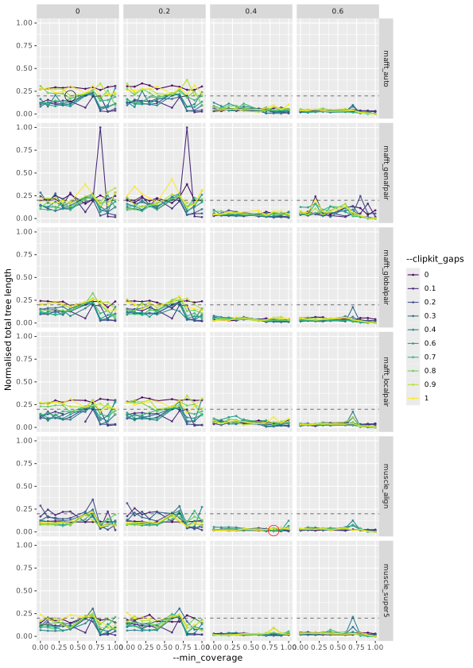

# tc_alignment_params

This is an attempt to tweak alignment and trimming params to generate better
trees from target capture output.

The phylogenetics experts in the team found the terminal branch lengths of the
trees were artificially long.

It's probably caused by very gappy alignments output from Captus with the
default settings.

## Summary

### This was done 30 samples from a single experiment. It needs to be tested on other data

It was only run with the ['Nuclear
proteins'](https://edgardomortiz.github.io/captus.docs/assembly/align/options/#-m---markers)
marker type and the ['Coding sequences in
nucleotides'](https://edgardomortiz.github.io/captus.docs/assembly/align/options/#-f---formats)
format.

The parameter that made the biggest difference to the output was
[`--min_coverage`](https://edgardomortiz.github.io/captus.docs/assembly/align/options/#--min_coverage).
Increasing this caused the gap score of the final alignments to tend towards
1.0 and the total branch length to reduce. However, it also reduced the number
of informative sites used to build the tree.

Lowering the allowed gaps in each column by reducing
[`--clipkit_gaps`](https://edgardomortiz.github.io/captus.docs/assembly/align/options/#--clipkit_gaps)
had the same effect, but it is less drastic, particularly at higher values of
`--min_coverage`.

Lastly, using the
[`--align_method`](https://edgardomortiz.github.io/captus.docs/assembly/align/options/#--align_method)
`muscle` instead of `mafft` resulted in a slight improvement but it is much
slower.

## Parameter exploration

The Snakefile runs `captus_align` followed by trimal and iqtree using the
following set of parameters:

```python
# Params
align_methods = [
    "mafft_auto",
    "mafft_genafpair",
    "mafft_localpair",
    "mafft_globalpair",
    "mafft_retree1",
    "mafft_retree2",
    "muscle_align",
    "muscle_super5",
]
clipkit_gaps = [round(float(x), 1) for x in np.linspace(0, 1, 10)]
min_coverages = [round(float(x), 1) for x in np.linspace(0, 1, 10)]
markers = ["NUC", "PTD", "MIT", "DNA", "CLR", "ALL"]
formats = ["AA", "NT", "GE", "GF", "MA", "MF", "ALL"]
sample_wscore_cutoffs = [
    round(float(x), 1) for x in np.linspace(0, 0.6, num=4)
]
```

All combinations are attempted (approx 3200), although some will fail.

## View the results

After running the full Snakefile, run

```
snakemake combine_trimal_and_iqtree_stats
```

The `combine_trimal_and_iqtree_stats` target will always run with no input. The
script finds stats files in the output directory and plots whatever is there.

The black dashed line is the results from running with the default parameters.

The result highlighed with a red circle is the "best" result, chosen by looking
at the naïve tree score.

### Gap score

The [gap score reported by
`trimal`](https://trimal.readthedocs.io/en/latest/scores.html#gap-score).


### Branch length

The total branch, reported by `IQTree` as "Total tree length (sum of branch
lengths)".



### Informative sites

The sum of informative sites, reported by `IQTree` as "Infor".


### Naïve tree score

This is a weighted combination of the previous parameters:

```R
all_metrics_with_params[
    ,
    naive_tree_score := ((2 * MedianGapScore_median) + normalised_sum_of_informative_sites - (2 * normalised_total_tree_length)) / 5
]
```


## Workflow


