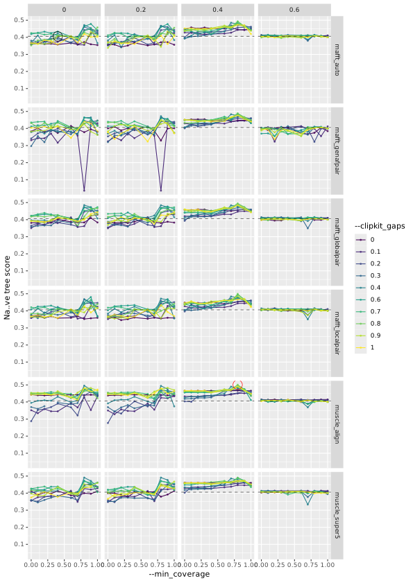

# tc-alignment-params

Trying to tweak alignment and trimming params to generate better trees from
target capture output.

## Parameter exploration

Runs `captus_align` followed by trimal and iqtree using the following set of
parameters:

```python
# Params
align_methods = [
    "mafft_auto",
    "mafft_genafpair",
    "mafft_localpair",
    "mafft_globalpair",
    "mafft_retree1",
    "mafft_retree2",
    "muscle_align",
    "muscle_super5",
]
clipkit_gaps = [round(float(x), 1) for x in np.linspace(0, 1, 10)]
min_coverages = [round(float(x), 1) for x in np.linspace(0, 1, 10)]
markers = ["NUC", "PTD", "MIT", "DNA", "CLR", "ALL"]
formats = ["AA", "NT", "GE", "GF", "MA", "MF", "ALL"]
sample_wscore_cutoffs = [
    round(float(x), 1) for x in np.linspace(0, 0.6, num=4)
]
```

All combinations are attempted (approx 3200), although some will fail.

## View the results

After running the full Snakefile, run

```
snakemake combine_trimal_and_iqtree_stats
```

The `combine_trimal_and_iqtree_stats` will always run with no input. The script
finds stats files in the output directory and plots whatever is there.

The black dashed line is the results from running with the default parameters.

The result highlighed with a red circle is the "best" result, chosen by looking
at the naïve tree score.

### Gap score

The [gap score reported by
`trimal`](https://trimal.readthedocs.io/en/latest/scores.html#gap-score).


### Naïve tree score

This is a weighed combination of the previous parameters:

```R
all_metrics_with_params[
    ,
    naive_tree_score := ((2 * MedianGapScore_median) + normalised_sum_of_informative_sites - (2 * normalised_total_tree_length)) / 5
]
```



## Workflow


